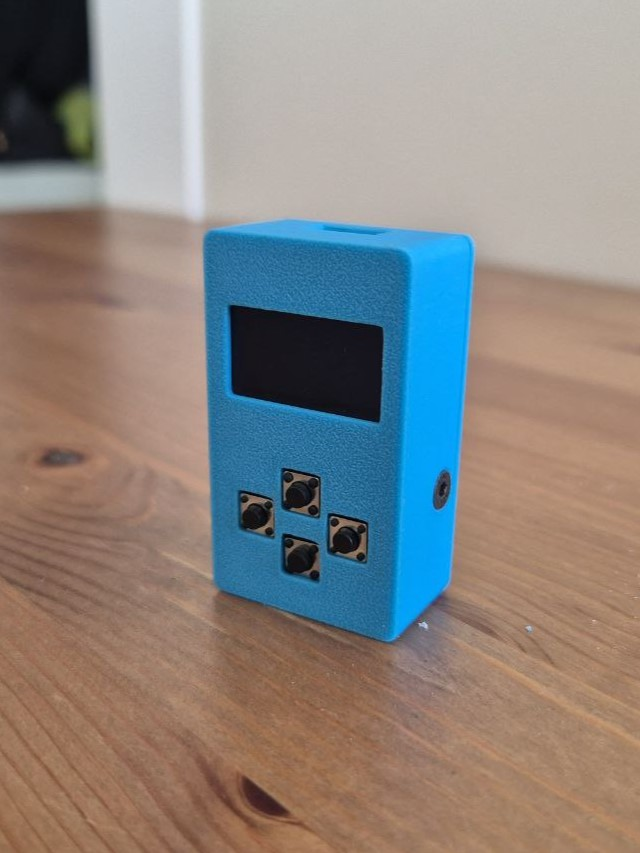

# Mini Arcade Gaming System

A portable handheld gaming console built with ESP8266 and featuring 8 classic games on a 0.96" OLED display.

**Detailed step-by-step instructions are provided in [Instructions.md](Instructions.md)** 



## 🎮 Featured Games

- **Snake** - Classic snake game with growing length
- **Tetris** - Block-stacking puzzle game with level progression
- **Flappy Bird** - Navigate through pipe obstacles
- **2048** - Number-merging puzzle game
- **Breakout** - Ball and paddle brick-breaking game
- **Frogger** - Cross roads and rivers while avoiding obstacles
- **Helicopter** - Navigate through a scrolling cave
- **Pac-Man** - Collect dots while avoiding ghosts

## 📋 Features

- **8 Built-in Games** with unique gameplay mechanics
- **Persistent Highscores** stored in EEPROM
- **Intuitive Menu System** with scrollable game selection
- **Compact Design** - Portable handheld form factor
- **USB Powered** - No batteries required

## 🛠 Hardware Requirements

### Components
- ESP8266 D1 Mini microcontroller
- I2C 0.96" OLED Display (128x64 pixels)
- 4x Push Buttons (6x6x5mm)
- Perforated grid board/prototype PCB
- 2x M3 countersunk screws (5-10mm)
- Thin wire for connections
- Solder

### Tools
- Soldering iron and solder
- Wire strippers
- Cutting pliers
- Cutter knife or saw (for PCB trimming)
- File/sandpaper
- Hot glue gun (optional)

## 🔌 Pin Configuration

| Component | ESP8266 Pin | Function |
|-----------|-------------|----------|
| OLED SDA | D2 (GPIO4) | I2C Data |
| OLED SCL | D1 (GPIO5) | I2C Clock |
| OLED VCC | VIN | 5V Power |
| OLED GND | GND | Ground |
| Button Up | D6 (GPIO12) | Up Input |
| Button Down | D7 (GPIO13) | Down Input |
| Button Left | D4 (GPIO2) | Left Input |
| Button Right | D5 (GPIO14) | Right Input |

## 📦 3D Printed Case

The custom 3D printed case files are available on MakerWorld:
**[Link to be added]**

The case features:
- Precise cutouts for display and buttons
- USB access port
- Snap-fit lid with screw reinforcement
- Ergonomic handheld design

## 🚀 Installation

### 1. Setup Arduino IDE
1. Download and install [Arduino IDE](https://www.arduino.cc/en/software/)
2. Add ESP8266 board support:
   - Go to File → Preferences
   - Add this URL to "Additional Boards Manager URLs":
     ```
     http://arduino.esp8266.com/stable/package_esp8266com_index.json
     ```
   - Open Tools → Board → Boards Manager
   - Search for "ESP8266" and install

### 2. Install Required Libraries
Install these libraries via Library Manager:
- **Adafruit SSD1306** (with all dependencies)
- **Adafruit GFX Library**

### 3. Upload Code
1. Clone or download this repository
2. Open `GameSystem.ino` in Arduino IDE
3. Select board: "LOLIN(WEMOS) D1 R2 & mini"
4. Select the correct COM port
5. Click Upload

## 🔧 Assembly Instructions

Detailed step-by-step assembly instructions are provided in [Instructions.md](Instructions.md), including:
- PCB preparation and trimming
- Component soldering and wiring
- Case assembly
- Final testing

## 🎯 Game Controls

### Menu Navigation
- **Up/Down**: Navigate between games
- **Right**: Select game
- **Up**: Return to menu (from game over screen)

### In-Game Controls
- **Snake**: Arrow keys to change direction
- **Tetris**: Left/Right to move, Down to drop, Up to rotate
- **Flappy Bird**: Up or Right to flap
- **2048**: Arrow keys to slide tiles
- **Breakout**: Left/Right to move paddle
- **Frogger**: Arrow keys to move
- **Helicopter**: Up or Right to lift
- **Pac-Man**: Arrow keys to move

## 💾 Highscore System

- Scores are automatically saved to EEPROM
- Each game maintains its own highscore
- Scores persist through power cycles
- "NEW HIGHSCORE!" notification on achievement

## 🔧 Technical Details

### Software Architecture
- **Modular Design**: Each game is implemented as a separate class
- **Game Manager**: Handles menu system and game state transitions
- **Input System**: Debounced button handling with press detection
- **Display Manager**: Centralized display control and utilities
- **Persistent Storage**: EEPROM-based highscore management with checksum validation

### Performance
- **Memory Usage**: Optimized for ESP8266's limited RAM
- **Power Consumption**: Low power design suitable for USB power banks

## 🐛 Troubleshooting

### Common Issues
- **Display not working**: Check I2C connections and display address (0x3C)
- **Buttons not responding**: Verify button wiring and pin assignments
- **Code won't upload**: Ensure correct board selection and COM port
- **Games running slowly**: Check for proper 60 FPS timing in code

### Debug Features
- Serial output for debugging (115200 baud)
- Hardware validation on startup
- EEPROM corruption detection and recovery

---

**Enjoy your retro gaming experience! 🕹️**